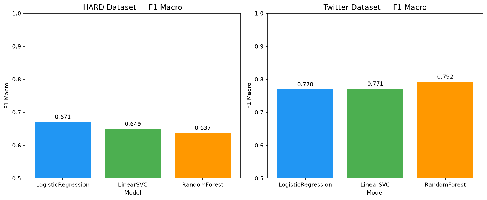
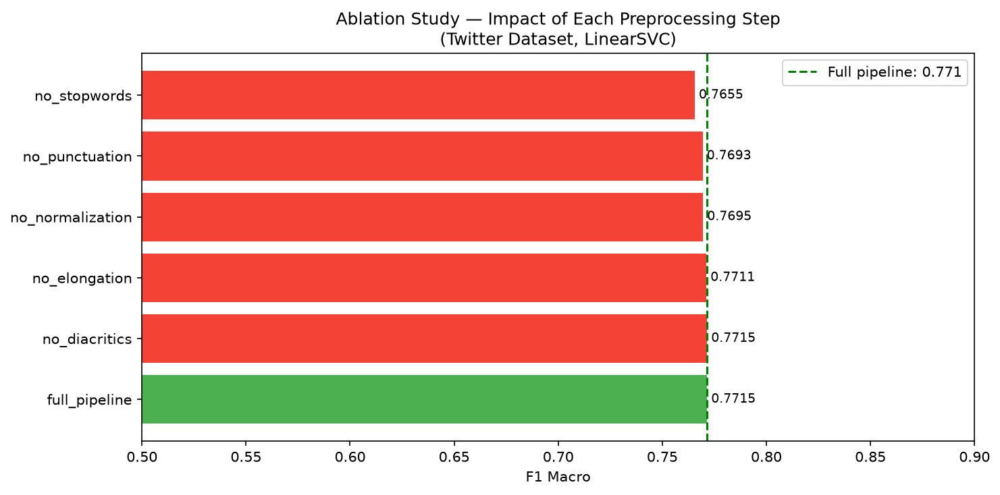

# Arabic NLP Pipeline

A modular, production-style preprocessing pipeline for Arabic text with an end-to-end sentiment classification experiment across two public datasets.

Built to answer a practical question: **which preprocessing steps actually matter for Arabic sentiment analysis — and by how much?**

---

## Motivation

Arabic NLP has a core challenge that English NLP does not: the same word can be written in multiple valid forms due to diacritics, alef variants, teh marbuta normalization, and dialectal elongation. Most Arabic NLP notebooks treat preprocessing as a throwaway step. This project treats it as the subject of study.

The pipeline is designed to be modular and measurable — each step can be toggled independently, which makes it possible to run a proper ablation study and quantify the contribution of each preprocessing decision.

---

## Project Structure

```
arabic-nlp-pipeline/
├── src/
│   ├── pipeline/
│   │   ├── base.py          # PipelineStep and ArabicTextPipeline base classes
│   │   └── steps.py         # 5 preprocessing steps
│   ├── features/
│   │   └── vectorizer.py    # Arabic TF-IDF with word and char n-gram modes
│   └── utils/
│       ├── data_loader.py   # Loaders for HARD and Twitter datasets
│       └── experiment.py    # Experiment runner and result dataclass
├── notebooks/
│   ├── 02_experiment.ipynb  # Full ML experiment across 3 models x 2 datasets
│   └── 03_ablation.ipynb    # Ablation study: per-step F1 impact
├── tests/
│   └── test_pipeline.py     # Unit tests for all pipeline steps
├── results/
│   ├── experiment_results.csv
│   ├── experiment_results.png
│   ├── ablation_results.csv
│   └── ablation_results.png
└── requirements.txt
```

---

## Pipeline Steps

The pipeline chains 5 independent preprocessing steps, each extending `PipelineStep`:

| Step | What it does | Example |
|------|-------------|---------|
| `DiacriticsRemover` | Strips tashkeel (short vowel marks) | `مَرحَباً` → `مرحبا` |
| `Normalizer` | Unifies alef variants, teh marbuta, alef maqsura | `أحمد` → `احمد`, `ة` → `ه` |
| `ElongationNormalizer` | Reduces repeated characters to max 2 | `مرحبااااا` → `مرحباا` |
| `PunctuationRemover` | Removes URLs, emojis, non-Arabic characters | `رائع 😍 https://x.com` → `رائع` |
| `StopwordRemover` | Removes common Arabic function words | `في`, `من`, `هذا`, ... |

Usage:

```python
from src.pipeline.base import ArabicTextPipeline
from src.pipeline.steps import (
    DiacriticsRemover, Normalizer, ElongationNormalizer,
    PunctuationRemover, StopwordRemover,
)

pipeline = ArabicTextPipeline([
    DiacriticsRemover(),
    Normalizer(),
    ElongationNormalizer(),
    PunctuationRemover(),
    StopwordRemover(),
])

pipeline.transform("الفُنْدُقُ كان ممتاززز جداً 😍 https://hotel.com")
# → 'الفندق ممتاز'
```

---

## Datasets

| Dataset | Domain | Classes | Size | Type |
|---------|--------|---------|------|------|
| [HARD](https://www.kaggle.com/datasets/abedkhooli/arabic-100k-reviews) | Hotel reviews | Positive / Mixed / Negative | 100K | MSA |
| [Arabic Twitter Sentiment](https://www.kaggle.com/datasets/mksaad/arabic-sentiment-twitter-corpus) | Tweets | Positive / Negative | 56K | Dialectal |

The two datasets were chosen deliberately: HARD is formal MSA text with 3 classes, Twitter is noisy dialectal Arabic with 2 classes. Running the same pipeline on both reveals how preprocessing decisions interact with domain and formality.

---

## Experiment Results

Three classifiers evaluated on both datasets using word-level TF-IDF (max 15K features, unigrams + bigrams):

| Dataset | Model | F1 Macro |
|---------|-------|----------|
| HARD | LogisticRegression | **0.671** |
| HARD | LinearSVC | 0.649 |
| HARD | RandomForest | 0.637 |
| Twitter | RandomForest | **0.792** |
| Twitter | LinearSVC | 0.771 |
| Twitter | LogisticRegression | 0.770 |



**Key finding:** Model ranking is not stable across datasets. LogisticRegression is the best performer on 3-class MSA (HARD), while RandomForest wins on binary dialectal Twitter. This suggests that model selection should be dataset-specific rather than defaulting to a single "best" classifier.

---

## Ablation Study

Each preprocessing step was removed independently while keeping all others active. LinearSVC on the Twitter dataset was used as the evaluation setting.

| Config | F1 Macro | Delta vs Full |
|--------|----------|---------------|
| full_pipeline | 0.7715 | — |
| no_diacritics | 0.7715 | 0.0000 |
| no_elongation | 0.7711 | -0.0004 |
| no_normalization | 0.7695 | -0.0020 |
| no_punctuation | 0.7693 | -0.0022 |
| no_stopwords | 0.7655 | -0.0060 |



**Key finding:** Stopword removal has the largest individual impact (-0.006 F1 when removed). This is consistent with known Arabic NLP literature — Arabic stopwords carry more syntactic and contextual weight than their English equivalents, and their removal forces the model to rely more on content words alone. Diacritics removal has zero measurable impact on dialectal Twitter text, which is expected since social media Arabic is rarely vocalized.

---

## Setup

```bash
git clone https://github.com/Ahmad-Rihawi/arabic-nlp-pipeline.git
cd arabic-nlp-pipeline
python -m venv .venv
# Windows:
.venv\Scripts\activate
pip install -r requirements.txt
```

Download datasets from Kaggle and place them in `data/raw/`:
- `ar_reviews_100k.tsv` (HARD dataset)
- `train_Arabic_tweets_negative_20190413.tsv`
- `train_Arabic_tweets_positive_20190413.tsv`
- `test_Arabic_tweets_negative_20190413.tsv`
- `test_Arabic_tweets_positive_20190413.tsv`

Run tests:
```bash
python -m pytest tests/ -v
```

---

## Tech Stack

`Python 3.14` · `pandas` · `scikit-learn` · `pyarabic` · `pytest`

---

## Author

Ahmad Rihawi — [LinkedIn](https://linkedin.com/in/ahmad-rihawi-ite) · [GitHub](https://github.com/Ahmad-Rihawi)